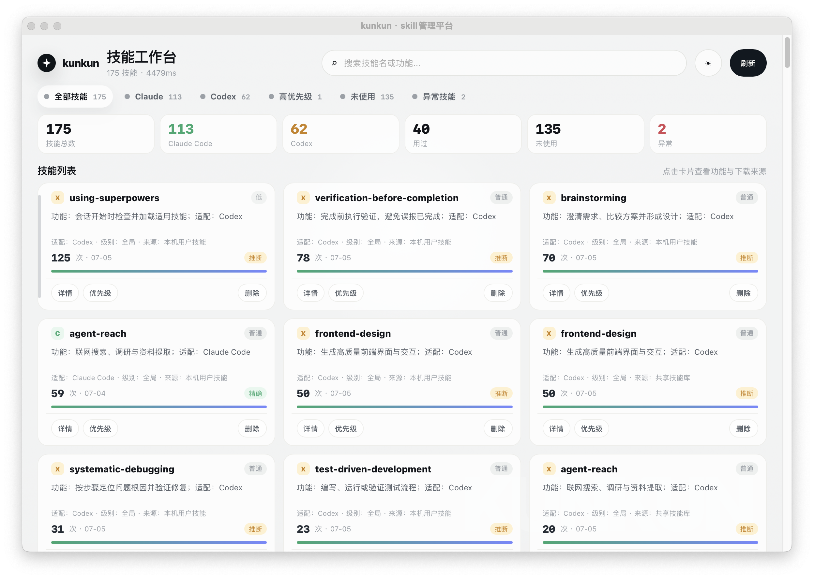
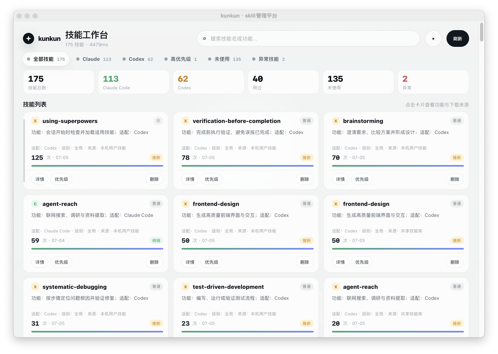
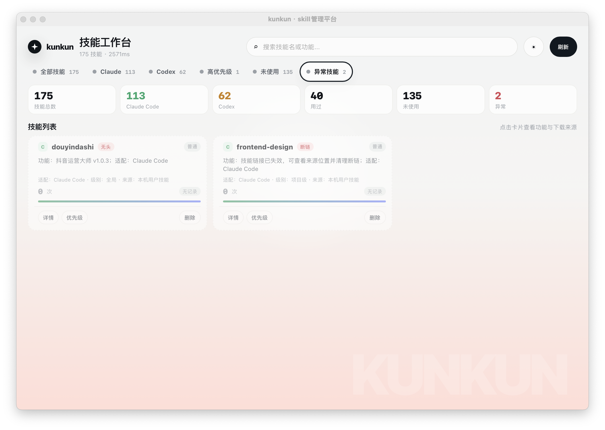

# kunkun SkillHub

一个本机优先的 Skill 管理平台，用来盘点、搜索、分类和体检本机的 Claude Code / Codex 技能。它会扫描本机安装的 Skill，显示总数、使用情况、适配软件、安装级别、下载来源和风险状态。

> 说明：这里的管理对象是 AI 编程工具里的 **Skill**，不是数据库 SQL。界面会标注适配 `Claude Code` 或 `Codex`，也会区分 `全局`、`项目级`、`插件级` 和 `外部` 来源。

## 界面预览

### 1. 整体布局



首页以 Skill 为主体：上方是搜索、刷新、浅色/深色切换和统计卡片；中间是 Skill 卡片列表。每张卡片会直接显示功能、适配软件、级别、来源、调用次数和健康状态。

### 2. 功能详情与来源



点击任意 Skill 可以查看详细信息，包括：

- 具体功能描述
- 适配软件：Claude Code 或 Codex
- 级别：全局、项目级、插件级或外部
- 下载来源、原始链接、更新链接
- 下载时间、首次使用、最近使用、更新时间
- 安装位置、真实位置和软链目标

### 3. 风险与异常展示



风险筛选会集中展示异常 Skill，例如：

- frontmatter 缺失
- 软链断连
- 真实路径不可达
- 来源位置需要检查

这些异常不会被自动删除。删除操作会先预检，并使用 macOS 废纸篓，避免误删共享源。

## 核心能力

- 本机扫描 Claude Code / Codex / Agents / 插件缓存中的 Skill
- 统计本机有多少 Skill、哪些用过、哪些未使用、哪些异常
- 区分全局 Skill、项目级 Skill、插件级 Skill 和外部链接 Skill
- 标注适配软件：Claude Code、Codex 或 Claude Code / Desktop
- 展示下载来源、更新链接、安装位置和真实路径
- 支持搜索、筛选、优先级标记和安全删除
- 前端没有文件系统权限，所有磁盘访问都由 Tauri 后端命令集中处理

## 项目结构

```text
.
├── scanner-core/              # Rust 扫描内核和 CLI
│   ├── src/inventory.rs       # Skill 发现、来源、级别和健康状态
│   ├── src/usage.rs           # Claude/Codex 调用统计
│   ├── src/deleter.rs         # 删除预检和移入废纸篓
│   └── tests/                 # 删除安全、用户元数据测试
├── desktop/
│   ├── dist/index.html        # 零依赖前端界面
│   └── src-tauri/             # Tauri 2 桌面端后端
├── docs/                      # 设计和验证文档
└── docs/assets/               # README 截图
```

## 本地运行

### CLI 扫描

```bash
cd scanner-core
cargo run --release -- inventory
cargo run --release -- usage
cargo run --release -- all
```

### 桌面应用

```bash
cd desktop/src-tauri
cargo tauri dev
```

### 构建 macOS App

```bash
cd desktop/src-tauri
cargo tauri build --bundles app
```

构建产物位于：

```text
desktop/src-tauri/target/release/bundle/macos/kunkun.app
```

## 测试

```bash
cd scanner-core
cargo test

cd ../desktop/src-tauri
cargo check
```

## 安全边界

- 默认只读扫描本机 Skill 和日志
- 用户元数据单独保存，不改写原始 Skill
- 删除前必须预检和确认
- 删除使用废纸篓，不直接 `rm`
- 软链只删除入口链接，不删除共享源目录

## License

MIT
